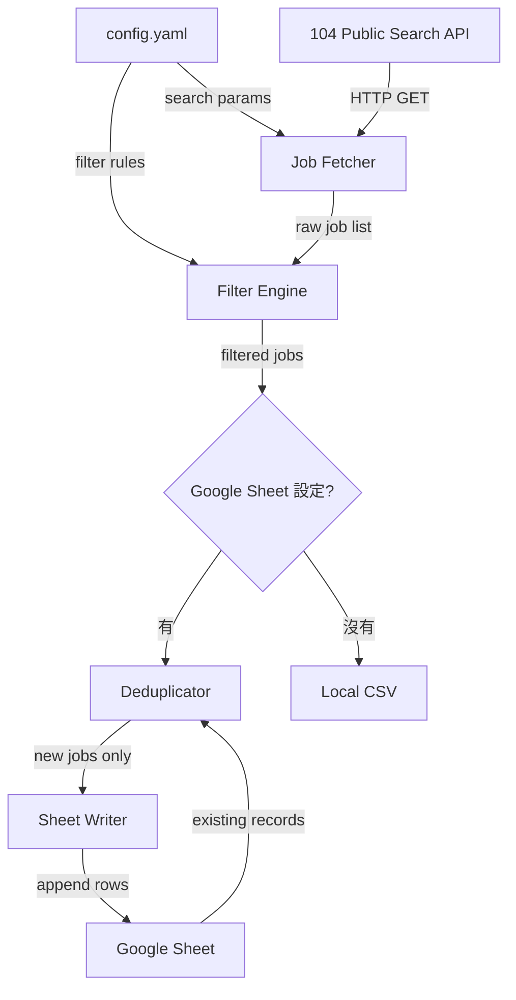

# kc_job_radar — 104 Job Radar

> **English summary:** Automated job search tool that queries 104.com.tw public API, filters results by configurable criteria, deduplicates against existing Google Sheet records, and writes new matches to a tracking spreadsheet.

## 概觀

### 要解決什麼問題

手動在 104 人力銀行瀏覽職缺太耗時。每天數百筆新職缺，逐一點開看 JD 再判斷要不要投，效率極低。需要一個自動化工具，依據預設條件篩選職缺，排除已投過的，把值得關注的新職缺直接寫進 Google Sheet 追蹤表。

### 誰會用

開發者本人（個人求職輔助工具）。開源後其他求職者也可以 fork 自用。

### 現有 Workaround

1. 手動瀏覽 104 搜尋結果
2. 看到有興趣的就投
3. 手動記錄到 Google Sheet（Jobs 追蹤表）
4. 定期用 job_refresh.py 刷新追蹤表狀態

## 架構



## 技術選型

| 決策 | 選擇 | 理由 |
|------|------|------|
| 語言 | Python 3 | 已有 gspread 整合經驗，生態系成熟 |
| HTTP client | httpx | 非同步支援、比 requests 現代 |
| Google Sheet | gspread + google-auth | 已有 credentials.json，job_refresh.py 驗證過可用 |
| 設定檔 | config.yaml | 人類可讀，方便改篩選條件 |
| 反爬對策 | random sleep (3-8s) + User-Agent 輪換 | 104 非高強度反爬，足夠 |

## 資料流 Pipeline

### 1. Job Fetcher
- 打 `GET https://www.104.com.tw/jobs/search/api/jobs`（從 104 Vue.js bundle 取得，舊的 `/jobs/search/list` 已下架）
- 帶 keyword、area、salary 等參數
- 支援多組搜尋條件（多個 keyword 組合）
- 分頁抓取（每頁 20 筆，抓到指定頁數或無更多結果）
- Random sleep between requests

### 2. Filter Engine
- 薪資門檻：年薪 >= 100 萬 或 面議
- 地區：台北市、台中市（可設定）
- 排除關鍵字：博弈、直銷、保險等
- 經歷要求：不限 ~ 10 年以上都收

### 3. Deduplicator（需要 google_sheet config）
- 從 Google Sheet「追蹤中」+「封存」兩個 tab 讀取已有紀錄
- 比對方式：公司名 + 職位名稱（避免重複投遞同一職缺）
- 也可用 104 job ID 比對（更精確）
- **未設定 google_sheet 時跳過此步驟**

### 4. Sheet Writer（需要 google_sheet config）
- 新職缺寫入 Google Sheet「追蹤中」tab
- 欄位對應：日期、判定（🆕 雷達新發現）、優先級（待評估）、公司、地點、職務、薪水、面試狀況（空）、備註（104 job URL）
- 不覆蓋既有資料，只 append
- **未設定 google_sheet 時，結果寫到本地 `radar.csv`**

## 設定檔策略

### 原則
- 所有可變設定都從 `config.yaml` 讀取，程式碼不寫死任何篩選條件
- repo 提供 `config.sample.yaml`（公開，含範例值和註解說明）
- 使用者複製成 `config.yaml` 填入自己的值
- `config.yaml` 加進 `.gitignore`，不進 repo
- **功能開關：config 中有對應 key 就啟用，沒有就跳過**
  - 沒給 `google_sheet` → 純 CLI 輸出，不寫 Sheet
  - 沒給 `telegram` → 不推通知
  - 沒給 `claude_api` → 不跑自動評估

### config.sample.yaml

見 repo 根目錄 `config.sample.yaml`，包含搜尋條件、篩選規則、反爬設定、Google Sheet、Scout、Telegram、Gmail 等所有可選區塊。

## Phase 規劃

### Phase A — CLI 概念驗證 ✅ 完成

| Spec | 功能 | 狀態 |
|------|------|------|
| 01-job-fetcher | 104 搜尋 API 串接 | ✅ DONE |
| 02-filter-dedup | 篩選 + Google Sheet/CSV 去重 | ✅ DONE |
| 03-sheet-writer | 寫入 Sheet 雷達 tab / CSV | ✅ DONE |
| 04-scout | 輕量版職缺評估 | ✅ DONE |
| 05-promote | 雷達 → 追蹤中搬移 | ✅ DONE |
| 06-cover-letter | 求職信 context 準備器 | ✅ DONE |

CLI 指令：
- `python3 -m src.radar` — 搜尋 + 篩選 + 去重 + 寫入雷達（順便封存「沒興趣」）
- `python3 -m src.scout` — 評估雷達 tab「需調查」
- `python3 -m src.promote` — 搬移「想投遞」到追蹤中
- `python3 -m src.cover_letter` — 產生求職信 context

### Phase B — 自動化服務（部署到 Mac Mini） ✅ 完成

| 功能 | 狀態 |
|------|------|
| B1: Docker 容器化 | ✅ DONE |
| B2: Cron 排程 | ✅ DONE |
| B3: Telegram 通知 | ✅ DONE |
| B4: Gmail 監聽 | ✅ DONE |
| Refresh（刷新追蹤表） | ✅ integrated（移植自 job_refresh.py） |
| Process（封存 + 升級 + 求職信 context） | ✅ integrated |
| Cover letter 撰寫 | ✅ context 由腳本產生，信件由 Claude Code 透過 Telegram skill 撰寫 |

#### 架構設計

自動化任務和互動任務分離：Docker cron 負責不需要 LLM 的排程任務，Claude Code skill 負責需要人機互動的操作。

```
Docker cron（自動化，不需要 LLM）:
  radar → scout → sort_radar → gmail_watch → refresh → Telegram notify

Claude Code skill（互動式，透過 Telegram 觸發）:
  寫求職信 → read context → write letters → zip → send Telegram
  跑 process → archive + promote + cover_letter
  跑 scout, refresh, radar → docker compose run
```

#### B1: Docker 容器化 ✅
- Phase A 所有功能包成 Docker image
- docker-compose.yml 管理服務，每個指令對應一個 service
- config.yaml / credentials 用 volume mount
- 部署到 Mac Mini

#### B2: Cron 排程 ✅
- Docker cron 執行完整 pipeline：radar → scout → sort_radar → gmail_watch → refresh → Telegram notify
- 執行日誌寫檔

#### B3: Telegram 通知 ✅
- Side-channel push via Bot API（與 Claude Code 共用同一個 bot）
- 雷達新職缺、Gmail 狀態變更、各種自動化結果都推 Telegram

#### B4: Gmail 監聽 ✅
- gmail_watch 掃描 104 通知信（cron 觸發，非 webhook）
- 解析信件類型：履歷已投遞、企業已讀取、企業已回覆、感謝函
- 自動更新 Google Sheet 追蹤中 tab 的判定欄位
- 同一封信不重複處理（記錄已處理的 message ID）

#### Refresh ✅
- 移植自獨立的 job_refresh.py，整合進 Docker pipeline
- 刷新追蹤表中職缺的最新狀態

#### Process ✅
- archive：封存過期或不感興趣的職缺
- promote：雷達 → 追蹤中搬移
- cover_letter：產生求職信 context（LLM 撰寫由 Claude Code skill 處理）

### 不列入規劃

- ~~B5: 本地 LLM 評估~~ — Phase A 規則評分夠用，有需要再加
- 不做 104 登入/認證
- 不做自動投遞（投遞是人的決策）
- 不做 104 以外的求職網站
- 不做 Web UI
